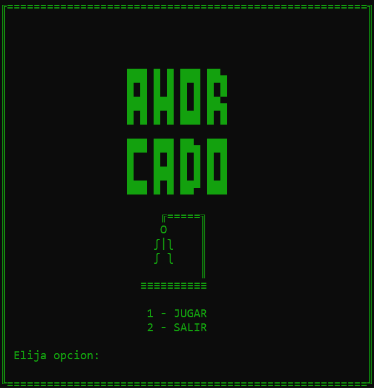
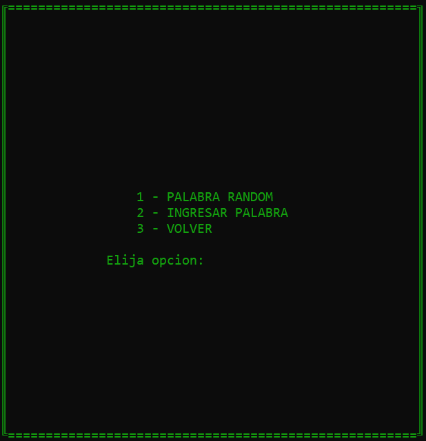
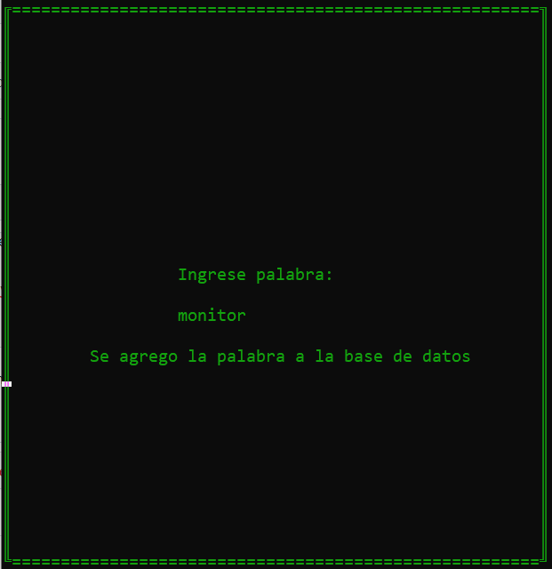

# Ahorcado

Es una representación del juego del ahorcado en Python. Se utilizo el paradigma orientado a objetos y se realizo una interfaz muy sencilla orientada a la practicidad. El jugador puede elegir entre una palabra al azar, la información esta guardada en un archivo".txt" y posteriormente pasado a una lista. Y por otro lado introducir una palabra, donde se revisa la lista y si no aparece la agrega al archivo pudiendo ser utilizada en otra oportunidad.

Elección del modo de ingresar al juego

Ingreso de palabra

Jugando

